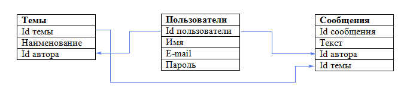

# Лекция 1

### БД, СУБД, определения

**Базы данных(БД) -** это набор данных, которые хранятся в каком-то порядке, используя набор правил, для хранения данных. \
**Системы управления Базами Данных(СУБД) -** это набор программного обеспечения и лингвистических средств, обеспечивающих возможностями управления, создания, удаления данных.\
Базы данных это то, что по сути хранится внутри СУБД. БД не занимаются управлениям данных и в одной СУБД может хранится несколько БД.&#x20;

### Виды СУБД

* Реляционные
  * MySQL
  * Oracle DB
  * PostgreSQL
  * Microsoft SQL Server(MS SQL Server)
  * DB2
  * SQLite
* Не-реляционные(NoSQL)[^1]
  * Документо-ориентированные
    * MongoDB
  * Графовые
    * Neo4J
  * Поисковые
    * Elastic Search
    * Sphinx
  * Объектно-ориентированные
    * DB4o
  * Ключ-значение
    * Redis
  * Распределенные
    * Casandra

Реляционные базы данных самые известный тип СУБД и в рамках данного курсам мы будем рассматривать именно этот тип. Суть реляционных БД в хранение банных в связанных таблицах. Реляционные СУБД базируется на реляционной алгебра, что позволяет реляционным СУБД считаться более "академическими" типом СУБД. На рисунке 1, представлен пример хранения данных.&#x20;

<figure><figcaption>
Рисунок 1. Пример хранения данных в реляционных СУБД
</figcaption></figure>

Реляционный подход к хранению дает как преимущества так и недостатки, поэтому со временем появился подход NoSQL, который рассматривает альтернативные варианты хранения данных.&#x20;

#### Документо-ориентированные

Документо-ориентированные СУБД позволяют решить проблему с хранением файлов внутри с которой сталкивается реляционных подход. В основе подхода лежать документные хранилища, которые имеют иерархическую структуру. В листьях дерева находятся части документов, из которых состоит документ. Листья индексируются, что дает возможность быстро найти данные, даже если структура дерева сложная.  На рисунке 2, представлена структура таких СУБД.

<figure><figcaption>
Рисунок 2. Принцип организации хранения документов в документо-ориентированной СУБД
</figcaption></figure>

#### Графовые

Графовые СУБД позволяют проводить визуальный анализ, а так-же позволяют избавиться от болячек SQL в виде длинных запросов JOIN, если нужно составить представление из нескольких таблиц.  Графыовые СУБД популярны для построения соц. сетей, хранение данных о персонажах вселенных и т.д. Кроме этого, финансовые структуры используют графовые СУБД для выявления различных финансовых афер, проводимых маошениками. На рисунке 3 представлен пример визуализации графов.

<figure><figcaption>
Рисунок 3. Визуализация графа
</figcaption></figure>

#### Поисковые

В государственном секторе часто хранятся огромные объемы данных, а так-же приходится организовывать постоянный доступ к поиску внутри этих объемов. Особенно актуально это, для неструктурированных данных таких как логи.  Поисковые СУБД используют индексацию лем, грамм или слов и дальше используются все формы слова для поиска информации. На рисунке 4 показан пример разбиения слов на различные индексы с последующем наслоением, что образует шинглы.

<figure><figcaption>
Рисунок 4. Пример генерации шинглов
</figcaption></figure>

#### Объектно-ориентированные

Объектно-ориентированные СУБД в чистом виде встречаются достаточно редко. Обычно, такая возможность предусмотрена реляционными СУБД, либо используется принцип ORM(Object-Relational Mapping), который позволяет решить проблему с представлением данных в виде объектов.  Однако объектно-ориентированные СУБД позволяют не решать проблему, которую решает ORM, то есть модель в MVC не создается, а хранится прямо в БД, что уменьшает затраты ресурсов на создание приложения. На рисунке 5 представлен пример объектно-ориентированной модели.

<figure><figcaption>
Рисунок 5. Сравнение оъектно-ориентированной и реляционной СУБД
</figcaption></figure>

#### Ключ-значение

СУБД Key-value отлично подходят, если надо осуществить быстрые запросы для кэша и простых значений. Key-value хранит большое количество данных в оперативной памяти, что позволяет ускорить процесс, а простая структура упрощает процесс получения данных. Словари хранят в себе коллекцию объектов, тогда как объекты хранят в себе множество полей, каждое из которых хранит в себе значение.  \
Так примером использования key-value явлвяется использование Redis в Discord. Эта СУБД позволяет быстро выгрузить последние сообщения с пользователем, что происходит практически моментально. Остальные данные, к котором редко обращаются или не обращались продолжительное время, хранятся в Casandra. На рисунке 6 представлен принцип key-value.

<figure><figcaption>
Рисунок 6. Key-value принцип
</figcaption></figure>

### Что умеет СУБД?

* Добавлять данные(CREATE)
* Удалять данные(DELETE)
* Изменять данные(UPDATE)
* Просматривать данные(READ)
* Добавлять таблицы
* Удалять таблицы
* Изменять таблицы
* Просматривать структуру таблиц

Данный список является минимальным необходимым для СУБД. Обычно СУБД имеют большой набор инструментов: визуализация модели данных, возможности экспорта, импорта, встроенные интерпретатор SQL, возможности создавать snapshot, триггеры, процедуры, функции и т.д.&#x20;

### Назначение БД

Базы данных существуют уже продолжительное время и позволяли хранить информацию структурировано и систематизировано. Так, например, базой данных можно назвать библиотеку в которой хранятся книги, читательские билеты(в которых указано на какой срок и какую книгу Вы взяли). Так-же любой архив или отдел данных это по сути базы данных, однако в бумажном виде. Цифровизация хранения данных позволила:

* обезопасить данные от физических повреждений(например архив может сгореть)
* &#x20;ускорить процесс поиска информации(не приходится перебирать огромные стопки, чтобы найти нужную информацию)
* снижение затрат на обслуживание(хранение цифровых данных требует гораздо меньше места, чем физическое)
* защитить данные от несанкционированного доступа

[^1]: Здесь приведены не все известные категории, т.к. некоторые из них редко применяются в реальных проектах или автор об этом не знает
